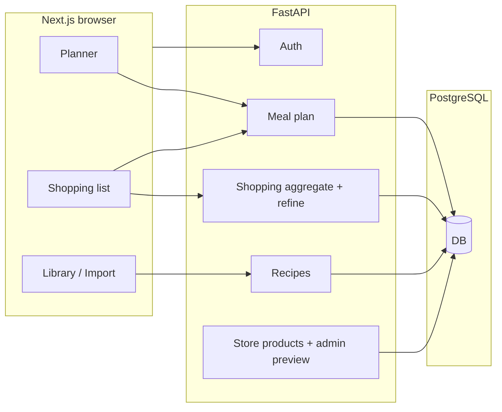

# Cooking — Codebase reference & walkthrough

This document is the **authoritative overview** of the repo: how the product flows end-to-end, where logic lives, how the UI is structured, how Docker/dev env works, and what is still incomplete. It is maintained to match the current code.

**Quick links:** [User journey](#end-to-end-user-journey) · [Backend](#backend) · [Frontend](#frontend) · [UI & design](#ui-and-design-language) · [Docker](#docker-and-local-compose) · [Environment](#environment-variables) · [Gaps](#known-gaps--debt)

---

## Repository layout

| Path | Role |
|------|------|
| `backend/` | FastAPI app, async SQLAlchemy, Alembic, OpenAI refine/extract, store cache warmer |
| `frontend/` | Next.js 14 App Router, client-heavy pages |
| `stitch/` | HTML design references (Stitch); not served by the app |
| `scripts/` | Manual cache warming / cache cleanup utilities |
| `docker-compose.yml` | Postgres + backend + frontend for containerized dev |
| `docker-compose.rds.yml.example` | Example override for RDS-style DB |

---

## End-to-end user journey

1. **Register / login**  
   JWT is stored in an `HttpOnly` cookie (`access_token`). All authenticated API calls use `credentials: "include"` (`frontend/app/lib/api.ts`).

2. **Import recipes** (`/import`)  
   YouTube link or pasted transcript → backend extracts structured recipe (LLM if `OPENAI_API_KEY` is set, else stub). Optional `title`, `library_category`, and `notes` can be provided up front. Saved per user.

3. **Library + public catalog** (`/library`, `/library/[id]`)  
   Users browse their private library, while a second tab exposes a **public recipe catalog**. Clicking **Add to my library** copies a curated public recipe into the current user’s own library. Catalog editors can publish/unpublish their own recipes from the edit screen.

4. **Weekly planner** (`/planner?week=YYYY-MM-DD`)  
   Monday-based week. Desktop keeps drag-and-drop from the sidebar; phones use slot-based recipe pickers with the same search + tag filters. Persisted with `PUT /meal-plan/{date}` and `GET /meal-plan?start=&end=`.

5. **Shopping list — confirmation** (`/shopping-list?week=...`)  
   Loads in parallel: aggregated ingredients `GET /shopping-list`, planned meals `GET /meal-plan`, and `GET /recipes` for titles. **No long raw ingredient list** on this screen: **week range**, **week-at-a-glance** (meal chips), stats, **Prepare smart shopping list** (this is the **only** call that runs the refine LLM — saves tokens).

6. **Shopping list — smart mode** (same route, after refine)  
   SessionStorage key `smartShoppingList:{weekStart}` stores refined payload + UI state. Category **bento** cards now split checked items into an **Already have** section at the bottom of each category, while unchecked items stay at the top as **to buy**. Users can copy the list, bulk-load store products inline, switch between Weee/Amazon, and the page warns if the planner changed after generation.

7. **Store cache warming + admin preview** (`backend` scheduler, `/preview`)  
   The backend warms a configured set of common store queries on startup and every 24 hours, using DB-backed persistent cache plus in-memory cache. Admins can inspect cached rows, see which rows are part of the configured warm set vs extra ad hoc cached rows, and manually refresh cache entries from the Preview page.

---

## High-level architecture

- **Deployment (typical):** frontend on Vercel, API on ECS/Fargate behind ALB, Postgres on RDS — adjust `CORS_ALLOW_ORIGINS`, `COOKIE_*`, and `NEXT_PUBLIC_API_BASE` accordingly.

---

## Backend

### Entrypoint (`backend/app/main.py`)

- `load_dotenv()` then validates `DATABASE_URL` via settings.
- Lifespan: `init_engine()` for async SQLAlchemy.
- Starts/stops the in-process cache warmer scheduler after DB init.
- CORS: explicit origins from `CORS_ALLOW_ORIGINS` when set; `allow_credentials=True` only when origins are explicit (required for cookies).
- Routers: `auth`, `recipes`, `meal-plan`, `shopping-list`, `store`, `admin` (prefixes as defined per router).
- **Static uploads:** `GET /uploads/...` via `StaticFiles` on `get_local_upload_root()` (default process cwd + `uploads/`).

### Configuration (`backend/app/core/config.py`)

- **Required:** `DATABASE_URL` — must be `postgresql+asyncpg://...`.
- **Optional:** `DATABASE_SSL`, `AUTH_SECRET`, `CORS_ALLOW_ORIGINS`, `COOKIE_SECURE`, `COOKIE_SAMESITE`, `OPENAI_API_KEY`.
- **S3:** `AWS_REGION` + `S3_BUCKET_NAME` — both set or both empty.
- **Local uploads:** `LOCAL_IMAGE_UPLOAD_DIR` optional; else `./uploads` relative to **process cwd** (when running from `backend/`, that is `backend/uploads`).

### Auth (`backend/app/api/auth.py`)

- `POST /auth/register`, `POST /auth/login`, `POST /auth/logout`, `GET /auth/me`.
- Cookie: HttpOnly, path `/`, max-age 7 days; `secure` / `samesite` from settings.
- `get_current_user`: JWT `sub` → user row; 401 if missing/invalid.

### Recipes (`backend/app/api/routes_recipes.py`)

- **Upload:** `POST /recipes/upload-image` (multipart). If S3 configured → presigned PUT + `file_url`. Else save bytes with `save_recipe_image_local` → `{ upload_url: "", file_url: "<origin>/uploads/recipes/..." }`.
- **Import:** e.g. `POST /recipes/import/link` with JSON body `{ "url", "title?", "library_category?", "notes?" }`; transcript path accepts the same optional metadata fields.
- **Public catalog:** `GET /recipes/catalog`, `POST /recipes/catalog/{recipe_id}/copy`, `GET /recipes/catalog/editor-status`, and `POST /recipes/{recipe_id}/catalog` for catalog editors.
- **CRUD:** list, get, create, patch, delete — all scoped by `user_id`.

### Meal plan (`backend/app/api/routes_mealplan.py`)

- `GET /meal-plan?start=&end=` — inclusive YYYY-MM-DD range.
- `PUT /meal-plan/{date}` — body `recipe_ids: string[]` (three slots: breakfast, lunch, dinner order in frontend).

### Shopping (`backend/app/api/routes_shopping.py`)

- `GET /shopping-list?start=&end=` — loads plans in range, resolves recipes, **aggregates** ingredients (`shopping_service.aggregate_ingredients`).
- `POST /shopping-list/refine` — body `{ items: [{ name, quantity }] }` → `refine_shopping_list` in `app/refine.py`. Response shape still includes `likely_pantry` (always **empty**); staples are expected under **`purchase_items`** with `grocery_category` **`Pantry & Dry Goods`**.

### Store products (`backend/app/api/routes_store.py`)

- `GET /store-products?query=&store=` — normalized query lookup for supported stores (`weee`, `amazon`).
- Read path: in-memory L1 cache → Postgres-backed L2 cache → live scrape if stale/missing.
- Store query normalization defensively strips banned modifiers like `新鲜` / `切块` before caching/scraping.

### Admin cache preview (`backend/app/api/admin.py`)

- Admin is currently email-gated via `app/core/admin.py`.
- `GET /admin/cache-preview` — paginated cache preview with warm-set classification, stale-only filter, TTL metadata, and separate warm vs extra cached counts.
- `GET /admin/cache-refresh-status` — current background refresh status/progress.
- `POST /admin/cache-refresh` — trigger global refresh (default stale-only).
- `POST /admin/cache-refresh-one` — force-refresh one query/store row.

### Refinement / LLM (`backend/app/refine.py`)

- **Prompts to edit:** `_build_system_prompt()` and `_build_user_prompt()` at the top of the workflow logic.
- **Model:** `gpt-4o-mini` via `AsyncOpenAI` when `OPENAI_API_KEY` is set; otherwise `_fallback_result` (no removal, all lines as `purchase_items`).
- **Output:** strict JSON with `remove` and `purchase_items` (each item has `name`, `suggested_purchase`, `grocery_category`). Parser **discards** any legacy `likely_pantry` from the model.

### Storage (`backend/app/services/storage_service.py`)

- `get_local_upload_root()`, `save_recipe_image_local()`, `generate_image_upload_url()` (S3 presign when configured).

### Database

- Models in `backend/app/db/models.py`; repositories `repo_recipes`, `repo_mealplan`, `repo_auth`, `repo_store_cache`.
- `CachedStoreProductModel` stores persistent store lookup cache keyed by `(query, store, language, cache_version)`.
- Migrations: `backend/alembic/versions/*`.

### Other services

- `extract_service.py` / `extract.py` — YouTube transcript + LLM extraction; stubs for upload/OCR paths. Link import now returns clearer errors for unsupported URLs and transcript/caption failures instead of silently creating a placeholder import.
- `shopping_service.py` — deterministic merge of ingredient lines.
- `services/store_scraper.py` — live scraping + PDP enrichment, cache read/write orchestration, and query normalization.
- `jobs/cache_warmer.py` / `jobs/cache_warmer_queries.py` — scheduled startup/daily stale-only warming and shared configured query catalog.

---

## Frontend

### API & auth

- **`frontend/app/config.ts`** — `getApiBase()`: `NEXT_PUBLIC_API_BASE` if set, else **`http://localhost:8000`** (local dev default).
- **`frontend/app/lib/api.ts`** — `apiFetch` always `credentials: "include"`; 401 → redirect to `/login` (except on auth pages).
- **`frontend/app/lib/auth.tsx`** — `AuthProvider`, `/auth/me`, logout.

### Routing & guards

- **`layout.tsx`** — `Header`, `AuthProvider`, Material Symbols link.
- **`RequireAuth`** — wraps protected pages.

### Pages (behavior summary)

| Route | Purpose |
|-------|---------|
| `/` | Redirect by auth |
| `/login`, `/register` | Auth forms |
| `/library` | Recipe grid + category chips |
| `/library/[id]` | Edit recipe, ingredients, library tag, image upload (conditional PUT to presigned URL) |
| `/recipe/[id]` | Read-only detail |
| `/import` | Link / transcript import |
| `/planner?week=` | 7-day grid, drag-drop, sidebar search, full-box click to add into empty slots |
| `/shopping-list?week=` | Confirmation UI → **Prepare smart** → smart bento + inline store picks |
| `/preview` | Admin-only cache preview / refresh dashboard |

### Client-only state

| Key | Use |
|-----|-----|
| `smartShoppingList:{weekMonday}` | Refined JSON + `_ui.hidden` / `_ui.checked` |
| `plannerWeekFingerprint:{weekMonday}` | Used to mark smart shopping list stale after planner edits |

### Shared libs

- **`lib/week.ts`** — `getWeekBounds`, `getPrevNextWeek`, `formatWeekRangeDisplay`, `formatWeekPlannerKicker`.
- **`lib/shoppingCategories.ts`** — `GROCERY_CATEGORY_ORDER`, `normalizeGroceryCategory`, Material icon names.
- **`lib/admin.ts`** — frontend admin email helper for Preview visibility.
- **`lib/recipeCategories.ts`** — library filter slugs.
- **`types.ts`** — `Recipe`, `IngredientItem`, etc.

### Components

- **`Header.tsx`**, **`NavAuth.tsx`**, **`RecipeCard.tsx`**, **`AuthShell.tsx`**, **`RequireAuth.tsx`** — shell and recipe cards.

---

## UI and design language

- **Global styles:** `frontend/app/globals.css` — CSS variables for the “editorial / Material” palette (e.g. `--primary`, `--surface-container-*`, `--tertiary`), system-font based typography, and large section blocks:
  - Planner editorial layout
  - Shopping confirmation hero (`shop-confirm-*`)
  - Smart shopping hero + bento (`shop-smart-*`, `shop-bento-*`)
  - Admin preview (`/preview`)
  - Recipe / import accents
- **Stitch references:** `stitch/*.html` — design targets; implementation uses CSS classes + Material Symbols, not Tailwind in production pages (except where inline utilities appear in TSX).
- **Static images:** `frontend/public/` — e.g. `shopping-list-hero.jpg` for confirmation page hero (avoids fragile hotlinked URLs). **Docker:** `frontend/Dockerfile` copies `public/` into the standalone image.

---

## Docker and local Compose

### `docker-compose.yml`

| Service | Port | Notes |
|---------|------|--------|
| `postgres` | 5432 | User/password/db `cooking`; healthcheck before backend starts |
| `backend` | 8000 | Runs `alembic upgrade head` then `uvicorn`; `DATABASE_URL` points at `postgres` service |
| `frontend` | 3000 | `NEXT_PUBLIC_API_BASE=http://localhost:8000` so **browser** on host talks to API on host |

**Volumes**

- `postgres_data` — database files
- `backend_data` — optional app data mount at `/app/data`
- **`./backend/uploads:/app/uploads`** — aligns with **default local upload root** inside container (`cwd` `/app` → `uploads` = `/app/uploads`). Recipe thumbnails when S3 is not configured persist here on the host.

**Env:** Backend loads `backend/.env` via `env_file`; ensure `AUTH_SECRET`, and either leave S3 unset for local disk uploads or set both AWS vars.

### Frontend container (`frontend/Dockerfile`)

- Multi-stage: `npm ci` → `next build` with `output: 'standalone'`.
- Runner copies: `.next/standalone`, `.next/static`, and **`public/`** (required for static assets).

### Backend container (`backend/Dockerfile`)

- `WORKDIR /app`, `PYTHONPATH=/app`; production CMD is uvicorn (Compose overrides with migrate + uvicorn).

---

## Environment variables (cheat sheet)

### Backend (see `backend/.env.example`)

- `DATABASE_URL` (required), `AUTH_SECRET`, `CORS_ALLOW_ORIGINS`, `OPENAI_API_KEY`, optional `AWS_*` / `LOCAL_IMAGE_UPLOAD_DIR`, cookie flags for prod cross-origin, optional `PUBLIC_LIBRARY_EDITOR_EMAILS` for catalog curation.

### Frontend (see `frontend/.env.local.example`)

- `NEXT_PUBLIC_API_BASE` — optional; if unset, client defaults to `http://localhost:8000` per `config.ts`. Set explicitly for phones, staging, or same-origin deploys.

---

## API quick reference

| Method | Path | Auth | Notes |
|--------|------|------|--------|
| POST | `/auth/register` | No | Sets cookie |
| POST | `/auth/login` | No | Sets cookie |
| POST | `/auth/logout` | No | Clears cookie |
| GET | `/auth/me` | Cookie | |
| GET/POST/PATCH/DELETE | `/recipes`… | Yes | CRUD + import + upload-image |
| GET | `/meal-plan` | Yes | `start`, `end` |
| PUT | `/meal-plan/{date}` | Yes | `recipe_ids` |
| GET | `/shopping-list` | Yes | `start`, `end` |
| POST | `/shopping-list/refine` | Yes | Refine only; no DB |
| GET | `/store-products` | Yes | Cached store lookup / scrape fallback |
| GET | `/admin/cache-preview` | Yes (admin) | Cache preview + metadata |
| GET | `/admin/cache-refresh-status` | Yes (admin) | Background refresh progress |
| POST | `/admin/cache-refresh` | Yes (admin) | Trigger global refresh |
| POST | `/admin/cache-refresh-one` | Yes (admin) | Refresh one query/store |
| GET | `/health` | No | |

OpenAPI: `/docs` when the API is running.

---

## What is implemented end-to-end

- Cookie auth; user-scoped recipes and meal plans.
- Planner with drag-drop on desktop, touch-friendly slot picking on phone, week URL param, and full-box click on empty add slots.
- Shopping confirmation UI + **on-demand** smart refinement.
- Smart list: categories, clearer checked/owned state, inline store picks, copy, bulk product loading, and stale-state warning when the planner changed after generation.
- Store lookup caching: in-memory + Postgres persistent cache, daily/startup warmer, manual refresh, admin preview.
- Public recipe catalog with copy-into-my-library flow.
- Local or S3 recipe images.
- YouTube link import + transcript import, with import-time title/tag overrides and clearer YouTube failure messages; LLM extraction and refine when key present.

---

## Known gaps / debt

1. **Video upload** transcript pipeline still stubbed; OCR path stubbed.
2. **Store integrations:** inline product previews exist, but there is still no true cart/checkout API.
3. **Public catalog curation:** admin/editor control is intentionally lightweight and email-gated by env when configured.
4. **Stitch assets** in `stitch/` are documentation-only.
5. Root **`README.md`** “Flow” is shorter; this file is the detailed reference.

---

## Risks and operations notes

- **Cross-origin auth:** production needs consistent `COOKIE_SECURE`, `COOKIE_SAMESITE`, and CORS origin matching the browser origin; frontend must keep `credentials: "include"`.
- **No OpenAI key:** extraction and refine fall back to stub/simple behavior — UI still works but output is degraded.
- **Refine tokens:** only consumed when user clicks **Prepare smart shopping list**, not when loading the page or restoring sessionStorage.

---

## Maintaining this document

When you change **flows** (new route, new session key), **refine prompt** (`refine.py`), **Docker**, or **major UI blocks** (`globals.css` / page structure), update the relevant sections here so onboarding and debugging stay accurate.
