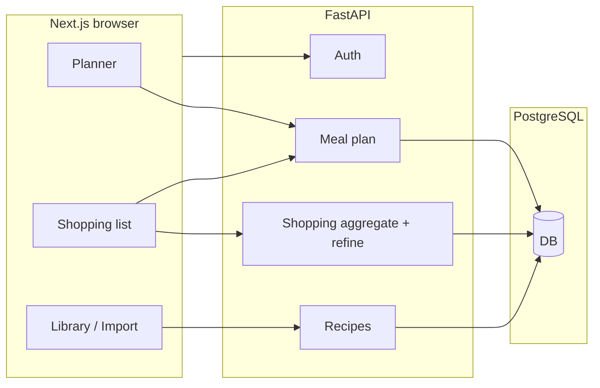

# Cooking — Codebase reference & walkthrough

This document is the **authoritative overview** of the repo: how the product flows end-to-end, where logic lives, how the UI is structured, how Docker/dev env works, and what is still incomplete. It is maintained to match the current code.

**Quick links:** [User journey](#end-to-end-user-journey) · [Backend](#backend) · [Frontend](#frontend) · [UI & design](#ui-and-design-language) · [Docker](#docker-and-local-compose) · [Environment](#environment-variables) · [Gaps](#known-gaps--debt)

---

## Repository layout

| Path | Role |
|------|------|
| `backend/` | FastAPI app, async SQLAlchemy, Alembic, OpenAI refine/extract |
| `frontend/` | Next.js 14 App Router, client-heavy pages |
| `stitch/` | HTML design references (Stitch); not served by the app |
| `docker-compose.yml` | Postgres + backend + frontend for containerized dev |
| `docker-compose.rds.yml.example` | Example override for RDS-style DB |

---

## End-to-end user journey

1. **Register / login**  
   JWT is stored in an `HttpOnly` cookie (`access_token`). All authenticated API calls use `credentials: "include"` (`frontend/app/lib/api.ts`).

2. **Import recipes** (`/import`)  
   YouTube link or pasted transcript → backend extracts structured recipe (LLM if `OPENAI_API_KEY` is set, else stub). Optional `notes` on import. Saved per user.

3. **Library** (`/library`, `/library/[id]`)  
   List, edit, delete recipes. **Thumbnail:** upload via `POST /recipes/upload-image` — either **S3 presigned PUT** (when `AWS_REGION` + `S3_BUCKET_NAME` set) or **local disk** under `./uploads` served at `/uploads/...` (default for local dev).

4. **Weekly planner** (`/planner?week=YYYY-MM-DD`)  
   Monday-based week. Drag recipes from sidebar into breakfast / lunch / dinner slots. Persisted with `PUT /meal-plan/{date}` and `GET /meal-plan?start=&end=`.

5. **Shopping list — confirmation** (`/shopping-list?week=...`)  
   Loads in parallel: aggregated ingredients `GET /shopping-list`, planned meals `GET /meal-plan`, and `GET /recipes` for titles. **No long raw ingredient list** on this screen: **week range**, **week-at-a-glance** (meal chips), stats, **Prepare smart shopping list** (this is the **only** call that runs the refine LLM — saves tokens).

6. **Shopping list — smart mode** (same route, after refine)  
   SessionStorage key `smartShoppingList:{weekStart}` stores refined payload + UI state. Category **bento** cards; **Copy full list** / **Shop on {store}** / **Store preview**. **Back to original list** clears smart session for that week and returns to the confirmation UI.

7. **Store preview** (`/store-preview?store=...`)  
   Legacy note: old manual store-preview flow has been removed. Smart shopping now loads live product results inline from supported stores.

---

## High-level architecture

- **Deployment (typical):** frontend on Vercel, API on ECS/Fargate behind ALB, Postgres on RDS — adjust `CORS_ALLOW_ORIGINS`, `COOKIE_*`, and `NEXT_PUBLIC_API_BASE` accordingly.

---

## Backend

### Entrypoint (`backend/app/main.py`)

- `load_dotenv()` then validates `DATABASE_URL` via settings.
- Lifespan: `init_engine()` for async SQLAlchemy.
- CORS: explicit origins from `CORS_ALLOW_ORIGINS` when set; `allow_credentials=True` only when origins are explicit (required for cookies).
- Routers: `auth`, `recipes`, `meal-plan`, `shopping-list` (prefixes as defined per router).
- **Static uploads:** `GET /uploads/...` via `StaticFiles` on `get_local_upload_root()` (default process cwd + `uploads/`).

### Configuration (`backend/app/core/config.py`)

- **Required:** `DATABASE_URL` — must be `postgresql+asyncpg://...`.
- **Optional:** `DATABASE_SSL`, `AUTH_SECRET`, `CORS_ALLOW_ORIGINS`, `COOKIE_SECURE`, `COOKIE_SAMESITE`, `OPENAI_API_KEY`.
- **S3:** `AWS_REGION` + `S3_BUCKET_NAME` — both set or both empty.
- **Local uploads:** `LOCAL_IMAGE_UPLOAD_DIR` optional; else `./uploads` relative to **process cwd** (when running from `backend/`, that is `backend/uploads`).

### Auth (`backend/app/api/auth.py`)

- `POST /auth/register`, `POST /auth/login`, `POST /auth/logout`, `GET /auth/me`.
- Cookie: HttpOnly, path `/`, max-age 7 days; `secure` / `samesite` from settings.
- `get_current_user`: JWT `sub` → user row; 401 if missing/invalid.

### Recipes (`backend/app/api/routes_recipes.py`)

- **Upload:** `POST /recipes/upload-image` (multipart). If S3 configured → presigned PUT + `file_url`. Else save bytes with `save_recipe_image_local` → `{ upload_url: "", file_url: "<origin>/uploads/recipes/..." }`.
- **Import:** e.g. `POST /recipes/import/link` with JSON body `{ "url", "notes?" }`; transcript path accepts `notes?`.
- **CRUD:** list, get, create, patch, delete — all scoped by `user_id`.

### Meal plan (`backend/app/api/routes_mealplan.py`)

- `GET /meal-plan?start=&end=` — inclusive YYYY-MM-DD range.
- `PUT /meal-plan/{date}` — body `recipe_ids: string[]` (three slots: breakfast, lunch, dinner order in frontend).

### Shopping (`backend/app/api/routes_shopping.py`)

- `GET /shopping-list?start=&end=` — loads plans in range, resolves recipes, **aggregates** ingredients (`shopping_service.aggregate_ingredients`).
- `POST /shopping-list/refine` — body `{ items: [{ name, quantity }] }` → `refine_shopping_list` in `app/refine.py`. Response shape still includes `likely_pantry` (always **empty**); staples are expected under **`purchase_items`** with `grocery_category` **`Pantry & Dry Goods`**.

### Refinement / LLM (`backend/app/refine.py`)

- **Prompts to edit:** `_build_system_prompt()` and `_build_user_prompt()` at the top of the workflow logic.
- **Model:** `gpt-4o-mini` via `AsyncOpenAI` when `OPENAI_API_KEY` is set; otherwise `_fallback_result` (no removal, all lines as `purchase_items`).
- **Output:** strict JSON with `remove` and `purchase_items` (each item has `name`, `suggested_purchase`, `grocery_category`). Parser **discards** any legacy `likely_pantry` from the model.

### Storage (`backend/app/services/storage_service.py`)

- `get_local_upload_root()`, `save_recipe_image_local()`, `generate_image_upload_url()` (S3 presign when configured).

### Database

- Models in `backend/app/db/models.py`; repositories `repo_recipes`, `repo_mealplan`, `repo_auth`.
- Migrations: `backend/alembic/versions/*`.

### Other services

- `extract_service.py` / `extract.py` — YouTube transcript + LLM extraction; stubs for upload/OCR paths.
- `shopping_service.py` — deterministic merge of ingredient lines.

---

## Frontend

### API & auth

- **`frontend/app/config.ts`** — `getApiBase()`: `NEXT_PUBLIC_API_BASE` if set, else **`http://localhost:8000`** (local dev default).
- **`frontend/app/lib/api.ts`** — `apiFetch` always `credentials: "include"`; 401 → redirect to `/login` (except on auth pages).
- **`frontend/app/lib/auth.tsx`** — `AuthProvider`, `/auth/me`, logout.

### Routing & guards

- **`layout.tsx`** — `Header`, `AuthProvider`, Material Symbols link.
- **`RequireAuth`** — wraps protected pages.

### Pages (behavior summary)

| Route | Purpose |
|-------|---------|
| `/` | Redirect by auth |
| `/login`, `/register` | Auth forms |
| `/library` | Recipe grid + category chips |
| `/library/[id]` | Edit recipe, ingredients, library tag, image upload (conditional PUT to presigned URL) |
| `/recipe/[id]` | Read-only detail |
| `/import` | Link / transcript import |
| `/planner?week=` | 7-day grid, drag-drop, sidebar search |
| `/shopping-list?week=` | Confirmation UI → **Prepare smart** → smart bento + actions |
| `/store-preview?store=` | Session-driven store search list |

### Client-only state

| Key | Use |
|-----|-----|
| `smartShoppingList:{weekMonday}` | Refined JSON + `_ui.hidden` / `_ui.checked` |
| `cooking-store-preview-items` | Items passed to store preview |
| `cooking-preferred-store` | Removed |

### Shared libs

- **`lib/week.ts`** — `getWeekBounds`, `getPrevNextWeek`, `formatWeekRangeDisplay`, `formatWeekPlannerKicker`.
- **`lib/store.ts`** — store URLs, labels, `buildItemQuery`, session keys.
- **`lib/shoppingCategories.ts`** — `GROCERY_CATEGORY_ORDER`, `normalizeGroceryCategory`, Material icon names, **`groceryCategoryBentoSpan` → always `6`** (two cards per row on large grids).
- **`lib/recipeCategories.ts`** — library filter slugs.
- **`types.ts`** — `Recipe`, `IngredientItem`, etc.

### Components

- **`Header.tsx`**, **`NavAuth.tsx`**, **`RecipeCard.tsx`**, **`AuthShell.tsx`**, **`RequireAuth.tsx`** — shell and recipe cards.

---

## UI and design language

- **Global styles:** `frontend/app/globals.css` — CSS variables for the “editorial / Material” palette (e.g. `--primary`, `--surface-container-*`, `--tertiary`), typography (Inter + Manrope via `layout.tsx`), and large section blocks:
  - Planner editorial layout
  - Shopping confirmation hero (`shop-confirm-*`)
  - Smart shopping hero + bento (`shop-smart-*`, `shop-bento-*`)
  - Store preview (`store-preview-*`)
  - Recipe / import accents
- **Stitch references:** `stitch/*.html` — design targets; implementation uses CSS classes + Material Symbols, not Tailwind in production pages (except where inline utilities appear in TSX).
- **Static images:** `frontend/public/` — e.g. `shopping-list-hero.jpg` for confirmation page hero (avoids fragile hotlinked URLs). **Docker:** `frontend/Dockerfile` copies `public/` into the standalone image.

---

## Docker and local Compose

### `docker-compose.yml`

| Service | Port | Notes |
|---------|------|--------|
| `postgres` | 5432 | User/password/db `cooking`; healthcheck before backend starts |
| `backend` | 8000 | Runs `alembic upgrade head` then `uvicorn`; `DATABASE_URL` points at `postgres` service |
| `frontend` | 3000 | `NEXT_PUBLIC_API_BASE=http://localhost:8000` so **browser** on host talks to API on host |

**Volumes**

- `postgres_data` — database files
- `backend_data` — optional app data mount at `/app/data`
- **`./backend/uploads:/app/uploads`** — aligns with **default local upload root** inside container (`cwd` `/app` → `uploads` = `/app/uploads`). Recipe thumbnails when S3 is not configured persist here on the host.

**Env:** Backend loads `backend/.env` via `env_file`; ensure `AUTH_SECRET`, and either leave S3 unset for local disk uploads or set both AWS vars.

### Frontend container (`frontend/Dockerfile`)

- Multi-stage: `npm ci` → `next build` with `output: 'standalone'`.
- Runner copies: `.next/standalone`, `.next/static`, and **`public/`** (required for static assets).

### Backend container (`backend/Dockerfile`)

- `WORKDIR /app`, `PYTHONPATH=/app`; production CMD is uvicorn (Compose overrides with migrate + uvicorn).

---

## Environment variables (cheat sheet)

### Backend (see `backend/.env.example`)

- `DATABASE_URL` (required), `AUTH_SECRET`, `CORS_ALLOW_ORIGINS`, `OPENAI_API_KEY`, optional `AWS_*` / `LOCAL_IMAGE_UPLOAD_DIR`, cookie flags for prod cross-origin.

### Frontend (see `frontend/.env.local.example`)

- `NEXT_PUBLIC_API_BASE` — optional; if unset, client defaults to `http://localhost:8000` per `config.ts`. Set explicitly for phones, staging, or same-origin deploys.

---

## API quick reference

| Method | Path | Auth | Notes |
|--------|------|------|--------|
| POST | `/auth/register` | No | Sets cookie |
| POST | `/auth/login` | No | Sets cookie |
| POST | `/auth/logout` | No | Clears cookie |
| GET | `/auth/me` | Cookie | |
| GET/POST/PATCH/DELETE | `/recipes`… | Yes | CRUD + import + upload-image |
| GET | `/meal-plan` | Yes | `start`, `end` |
| PUT | `/meal-plan/{date}` | Yes | `recipe_ids` |
| GET | `/shopping-list` | Yes | `start`, `end` |
| POST | `/shopping-list/refine` | Yes | Refine only; no DB |
| GET | `/health` | No | |

OpenAPI: `/docs` when the API is running.

---

## What is implemented end-to-end

- Cookie auth; user-scoped recipes and meal plans.
- Planner with drag-drop and week URL param.
- Shopping confirmation UI + **on-demand** smart refinement.
- Smart list: categories, checkboxes, copy, preferred store, store preview handoff.
- Local or S3 recipe images.
- YouTube link import + transcript import; LLM extraction and refine when key present.

---

## Known gaps / debt

1. **Video upload** transcript pipeline still stubbed; OCR path stubbed.
2. **Store integrations:** preview opens retailer search URLs only; no cart API.
3. **Header shopping link** does not append `?week=` — user lands on current week from shopping list defaults.
4. **Stitch assets** in `stitch/` are documentation-only.
5. Root **`README.md`** “Flow” is shorter; this file is the detailed reference.

---

## Risks and operations notes

- **Cross-origin auth:** production needs consistent `COOKIE_SECURE`, `COOKIE_SAMESITE`, and CORS origin matching the browser origin; frontend must keep `credentials: "include"`.
- **No OpenAI key:** extraction and refine fall back to stub/simple behavior — UI still works but output is degraded.
- **Refine tokens:** only consumed when user clicks **Prepare smart shopping list**, not when loading the page or restoring sessionStorage.

---

## Maintaining this document

When you change **flows** (new route, new session key), **refine prompt** (`refine.py`), **Docker**, or **major UI blocks** (`globals.css` / page structure), update the relevant sections here so onboarding and debugging stay accurate.
